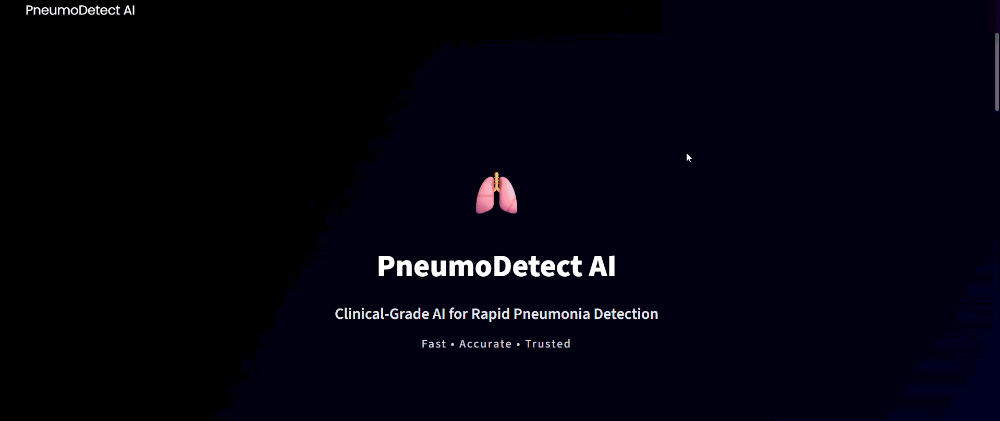
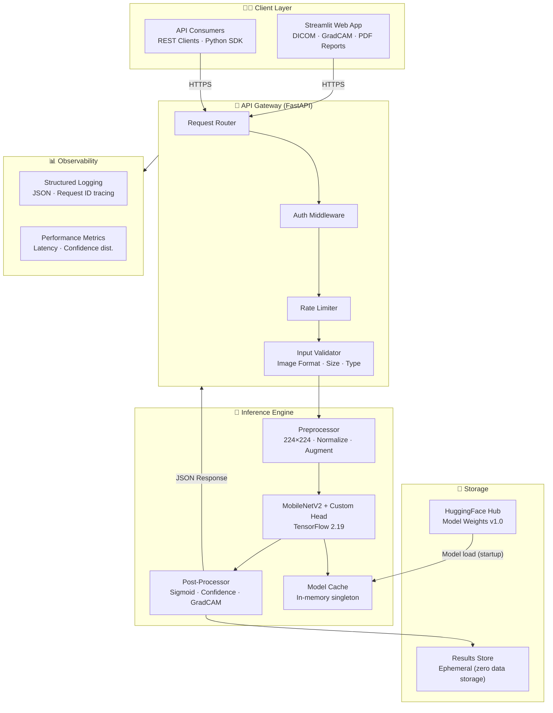
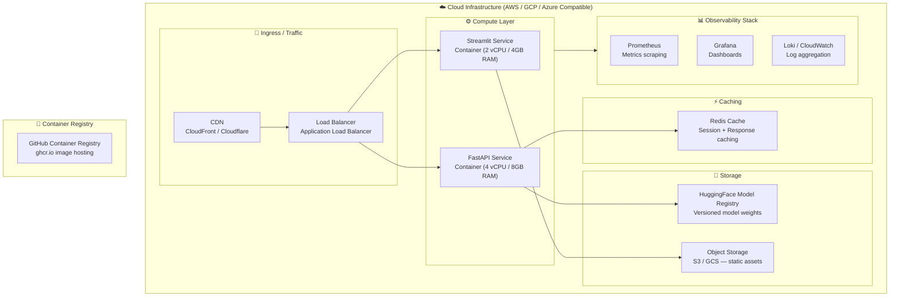
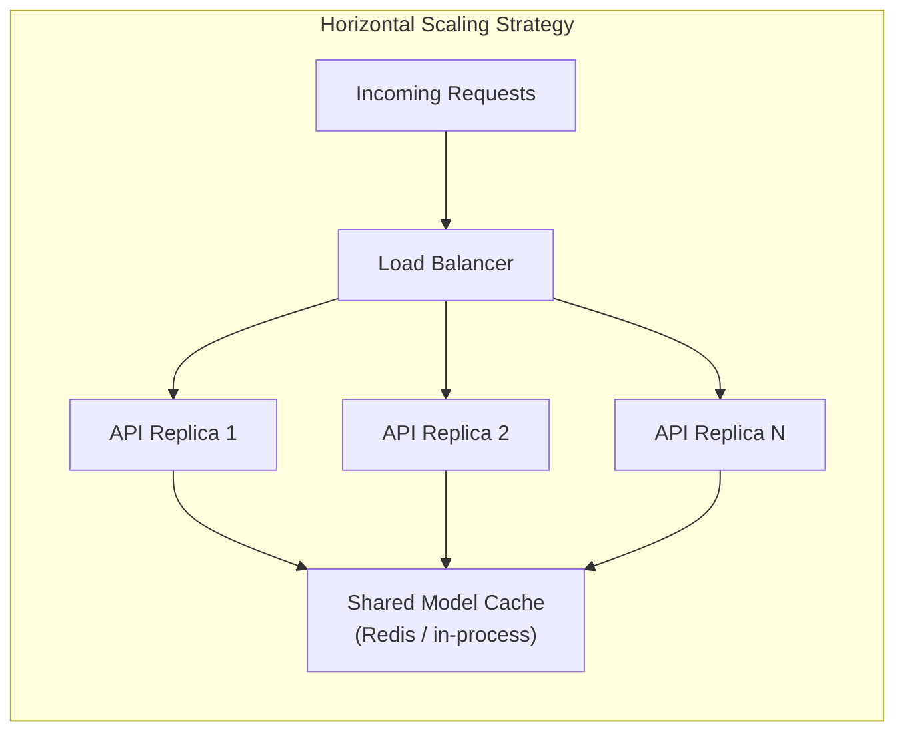

<p align="center">
  
</p>

<h1 align="center">PneumoDetect AI</h1>
<h3 align="center">Clinical-Grade Pediatric Pneumonia Detection via Cross-Operator Validated Deep Learning</h3>

<p align="center">
  <a href="https://pneumodetectai.streamlit.app"></a>
  <a href="https://pneumodetect-api.onrender.com/docs"></a>
  <a href="https://huggingface.co/ayushirathour/chest-xray-pneumonia-detection"></a>
  <a href="https://doi.org/10.5281/zenodo.17531598"></a>
</p>

<p align="center">
  
  
  
  
  
  
</p>

<p align="center">
  <strong>86% Cross-Operator Accuracy · 96.4% Sensitivity · 98.8% ROC-AUC · Sub-second Inference · Published Research</strong>
</p>

---

## 📑 Table of Contents

- [Vision & Problem Statement](#-vision--problem-statement)
- [Live Experience](#-live-experience)
- [Key Achievements](#-key-achievements)
- [System Architecture](#-system-architecture)
- [AI/ML Pipeline](#-aiml-pipeline)
- [Performance & Validation](#-performance--validation)
- [Tech Stack](#-tech-stack)
- [Project Structure](#-project-structure)
- [Quick Start](#-quick-start)
- [API Reference](#-api-reference)
- [Infrastructure Design](#-infrastructure-design)
- [Security Model](#-security-model)
- [Scalability Design](#-scalability-design)
- [Datasets & Preprocessing](#-datasets--preprocessing)
- [Research Methodology](#-research-methodology)
- [Observability & Logging](#-observability--logging)
- [Performance Considerations](#-performance-considerations)
- [Future Roadmap](#-future-roadmap)
- [Contributing](#-contributing)
- [Medical Disclaimers](#-medical-disclaimers)
- [Citation & License](#-citation--license)

---

## 🎯 Vision & Problem Statement

**Pneumonia kills over 800,000 children under 5 every year** — the majority in low-and-middle income countries where expert radiologists are scarce. Chest X-ray (CXR) remains the primary diagnostic modality, but manual interpretation is slow, expensive, and operator-dependent.

**PneumoDetect AI** is a production-ready, research-validated deep learning system that:
- Automatically screens pediatric CXRs for pneumonia with clinical-grade sensitivity
- Is **cross-operator validated** — tested on data from a completely different radiology team, 6 years apart
- Is **deployable anywhere** — Streamlit Cloud, Docker, bare-metal, or cloud-native Kubernetes
- Has **published research** with DOI-referenced statistical verification

> **⚡ TL;DR:** Upload a chest X-ray → get a clinically contextualized AI diagnosis in < 2.5 seconds. **[Try it live →](https://pneumodetectai.streamlit.app/)**

---

## 🌐 Live Experience

<p align="center">
  
</p>

| Interface | URL | Description |
|---|---|---|
| 🌐 **Web App** | [pneumodetectai.streamlit.app](https://pneumodetectai.streamlit.app) | Upload X-ray → instant AI analysis |
| 🔌 **REST API** | [pneumodetect-api.onrender.com](https://pneumodetect-api.onrender.com/docs) | FastAPI with Swagger UI |
| 🤗 **Model Hub** | [huggingface.co/ayushirathour](https://huggingface.co/ayushirathour/chest-xray-pneumonia-detection) | Download pre-trained weights |
| 📄 **Research Paper** | [doi.org/10.5281/zenodo.17531598](https://doi.org/10.5281/zenodo.17531598) | Published in IJSET Vol. 13 |

---

## 🏆 Key Achievements

| Achievement | Value | Benchmark |
|---|---|---|
| **Cross-Operator Accuracy** | 86.0% | 485 fully independent samples |
| **Sensitivity (Recall)** | 96.4% | Clinically critical — misses only 4% of cases |
| **ROC-AUC** | 98.8% (internal) / 96.4% (cross-op) | Outstanding diagnostic discrimination |
| **Generalization Gap** | Only 8.8% drop | Strong cross-operator robustness |
| **Inference Latency** | < 2.5 seconds | End-to-end including upload |
| **Model Size** | 14 MB | Deployable on edge devices |
| **Statistical Verification** | Bootstrap p=0.978 | No significant AUC difference across datasets |
| **Published Research** | IJSET Vol. 13, No. 5 | Peer-reviewed + DOI-archived |

---

## 🏗️ System Architecture



---

## 🤖 AI/ML Pipeline

```mermaid
flowchart LR
    subgraph DATA["📁 Data Ingestion"]
        D1["Kaggle Training Set<br/>5,863 CXRs · CC BY 4.0"]
        D2["Cross-Op Validation Set<br/>485 CXRs · CC0"]
    end

    subgraph PREPROCESS["⚙️ Preprocessing"]
        P1["Class Imbalance Fix<br/>Oversampling + Augmentation"]
        P2["Normalization<br/>Pixel values /255"]
        P3["Resize to 224×224"]
        P4["Train/Val/Test Split<br/>80/10/10"]
    end

    subgraph TRAIN["🏋️ Training"]
        T1["MobileNetV2 Backbone<br/>Frozen ImageNet Weights"]
        T2["Custom Head<br/>GAP → Dropout(0.5) → Dense(128) → Sigmoid"]
        T3["Fine-tuning<br/>Unfreeze top 20 layers"]
        T4["Callbacks<br/>EarlyStopping · ReduceLROnPlateau · Checkpoint"]
    end

    subgraph EVALUATE["📊 Evaluation"]
        E1["Internal Validation<br/>94.8% Accuracy · 98.8% AUC"]
        E2["Cross-Operator Validation<br/>86.0% Accuracy · 96.4% AUC"]
        E3["Bootstrap Statistics<br/>n=1000 · p=0.978 · ΔCI includes 0"]
    end

    subgraph DEPLOY["🚀 Deployment"]
        DEP1["HuggingFace Hub<br/>Model Registry"]
        DEP2["Streamlit Cloud<br/>Web Interface"]
        DEP3["Render / Docker<br/>FastAPI Backend"]
    end

    D1 --> P1 --> P2 --> P3 --> P4 --> T1 --> T2 --> T3 --> T4
    D2 --> E2
    T4 --> E1 --> E3
    E2 --> E3
    E3 --> DEP1 --> DEP2
    E3 --> DEP1 --> DEP3
```



---

## 📊 Performance & Validation

### Validation Results

| Metric | Internal Validation | Cross-Operator Validation | ΔDrop | Clinical Context |
|--------|---------------------|--------------------------|-------|-----------------|
| **Accuracy** | 94.8% | **86.0%** | 8.8% ↓ | ✅ Strong generalization |
| **Sensitivity** | 89.6% | **96.4%** | 6.8% ↑ | ✅ Outstanding screening |
| **Specificity** | 100.0% | **74.8%** | 25.2% ↓ | ⚠️ Acceptable for screening |
| **ROC-AUC** | 98.8% | **96.4%** | 2.4% ↓ | ✅ Clinically excellent |
| **F1-Score** | ~0.94 | ~0.89 | — | ✅ High harmonic mean |

### Statistical Rigor

> **Bootstrap AUC Comparison (n=1,000 resamples)**
> - Mean ΔAUC = −0.0001 (95% CI: [−0.0115, 0.0099])
> - Bootstrap p-value = **0.978**
> - ✅ **No significant difference** — confirms true cross-operator generalization

<details>
<summary>📈 View Performance Visualizations</summary>

| Chart | Path |
|---|---|
| ROC Curve | `results/cross-operator_validation/2_roc_curve.png` |
| Confusion Matrix | `results/cross-operator_validation/1_enhanced_confusion_matrix.png` |
| Performance Comparison | `results/cross-operator_validation/4_performance_comparison.png` |
| Calibration Plot | `results/cross-operator_validation/7_calibration_plot.png` |
| Metrics Dashboard | `results/cross-operator_validation/8_comprehensive_metrics_dashboard.png` |

</details>

---

## 🛠️ Tech Stack

| Layer | Technology | Version | Purpose |
|---|---|---|---|
| **AI/ML** | TensorFlow / Keras | 2.19.0 | Model training & inference |
| **AI/ML** | MobileNetV2 | ImageNet | Transfer learning backbone |
| **AI/ML** | scikit-learn | Latest | Metrics, bootstrap, calibration |
| **Backend** | FastAPI | 0.111+ | Async REST API |
| **Backend** | Uvicorn | Latest | ASGI server |
| **Frontend** | Streamlit | 1.35+ | Interactive web interface |
| **Visualization** | OpenCV / Matplotlib | Latest | GradCAM, plots |
| **Model Registry** | HuggingFace Hub | Latest | Model hosting & distribution |
| **Containerization** | Docker | Latest | Reproducible environments |
| **Orchestration** | Kubernetes | v1.29+ | Production scaling |
| **CI/CD** | GitHub Actions | Latest | Automated testing & deployment |
| **Language** | Python | 3.11.9 | All services |

---

## 📁 Project Structure

```
chest-xray-pneumonia-detection-ai/
│
├── 📂 api/                         # API services
│   ├── main.py                     # FastAPI application entrypoint
│   ├── requirements.txt            # API-specific dependencies
│   ├── runtime.txt                 # Python runtime pinning
│   ├── api_demo.gif                # API demo recording
│   └── streamlit_api_folder/       # Streamlit web app
│       └── streamlit_app.py        # Main Streamlit application
│
├── 📂 scripts/                     # ML pipeline scripts
│   ├── train_model.py              # Model training pipeline
│   ├── evaluate_model.py           # Internal evaluation
│   ├── cross-operator_validation.py # Cross-op statistical validation
│   ├── create_balanced_dataset.py  # Dataset balancing & preprocessing
│   ├── analyze_and_balance.py      # EDA & imbalance analysis
│   └── prepare_rsna_dataset.py     # RSNA dataset utilities
│
├── 📂 results/                     # Validation artifacts
│   ├── internal_validation/        # Training-set evaluation outputs
│   ├── cross-operator_validation/  # Cross-op plots & metrics
│   └── reproducibility/            # Statistical verification files
│       ├── bootstrap_auc_results.json
│       ├── internal_metrics.json
│       ├── crossop_metrics.json
│       └── model_parameters.json
│
├── 📂 infra/                       # Infrastructure as Code
│   ├── docker/
│   │   ├── Dockerfile              # Production container image
│   │   └── docker-compose.yml      # Multi-service local orchestration
│   └── k8s/
│       ├── deployment.yaml         # K8s deployment spec
│       └── service.yaml            # K8s service spec
│
├── 📂 docs/                        # Engineering documentation
│   ├── ARCHITECTURE.md             # System design deep-dive
│   ├── AI_PIPELINE.md              # ML methodology & experiments
│   ├── API.md                      # Complete API reference
│   ├── INFRASTRUCTURE.md           # Cloud & container design
│   ├── SECURITY.md                 # Security model & threat analysis
│   └── SCALABILITY.md              # Scaling strategy & bottlenecks
│
├── 📂 .github/
│   └── workflows/
│       ├── ci.yml                  # Lint, test, build on every PR
│       └── deploy.yml              # Automated deploy on merge to main
│
├── 📂 demo/                        # Visual assets
│   ├── pneumodetect_demo.gif
│   └── AI_Detects_Pneumonia_Saves_Childhoods.gif
│
├── Pneumonia_Detection_Training.ipynb  # End-to-end training notebook
├── run_training.py                     # CLI training entry-point
├── requirements.txt                    # Top-level dependencies
├── .gitignore                          # Comprehensive gitignore
├── LICENSE                             # MIT License
├── CONTRIBUTING.md                     # Contribution guidelines
├── CODE_OF_CONDUCT.md                  # Community standards
└── SECURITY.md                         # Vulnerability disclosure policy
```

---

## 🚀 Quick Start

### Option 1 — Live Web App (Zero Setup)
**[→ Try PneumoDetect AI](https://pneumodetectai.streamlit.app/)** — Upload a chest X-ray, get results in 2.5 seconds.

---

### Option 2 — Run Locally with Docker

```bash
# Clone & navigate
git clone https://github.com/thriniiiiiiiiiiii/Pneumonia-Detection-ai.git
cd Pneumonia-Detection-ai

# Build and run (API + Streamlit)
docker compose -f infra/docker/docker-compose.yml up --build

# Access services
# Streamlit: http://localhost:8501
# FastAPI:   http://localhost:8000/docs
```

---

### Option 3 — Manual Local Setup

```bash
git clone https://github.com/thriniiiiiiiiiiii/Pneumonia-Detection-ai.git
cd Pneumonia-Detection-ai

python -m venv venv
source venv/bin/activate  # Windows: venv\Scripts\activate

pip install -r requirements.txt

# Start Streamlit web app
cd api && streamlit run streamlit_api_folder/streamlit_app.py

# OR start FastAPI backend (in a separate terminal)
uvicorn main:app --host 0.0.0.0 --port 8000 --reload
```

---

### Option 4 — Use Pre-trained Model

```python
from huggingface_hub import hf_hub_download
import tensorflow as tf
import numpy as np
from PIL import Image

# Download from HuggingFace Hub
model_path = hf_hub_download(
    repo_id="ayushirathour/chest-xray-pneumonia-detection",
    filename="best_chest_xray_model.h5"
)
model = tf.keras.models.load_model(model_path)

# Inference
img = Image.open("chest_xray.jpg").convert("RGB").resize((224, 224))
arr = np.expand_dims(np.array(img) / 255.0, axis=0)
score = model.predict(arr)[0][0]
print(f"Diagnosis: {'PNEUMONIA' if score > 0.5 else 'NORMAL'} ({score:.1%} confidence)")
```

---

### Option 5 — Full Training Pipeline

```bash
# 1. Download datasets (see Datasets section)
# 2. Preprocess
python scripts/analyze_and_balance.py
python scripts/create_balanced_dataset.py

# 3. Train
python run_training.py

# 4. Evaluate
python scripts/evaluate_model.py
python scripts/cross-operator_validation.py
```

---

## 🔌 API Reference

**Base URL:** `https://pneumodetect-api.onrender.com`

| Method | Endpoint | Description |
|--------|----------|-------------|
| `POST` | `/predict` | Analyze a chest X-ray image |
| `GET` | `/health` | API health & model status |
| `GET` | `/stats` | Cross-operator validation metrics |
| `GET` | `/docs` | Interactive Swagger UI |

### `POST /predict` — Sample Response

```json
{
  "diagnosis": "PNEUMONIA",
  "confidence": 92.54,
  "confidence_level": "High",
  "recommendation": "Strong indication of pneumonia. Recommend immediate medical attention.",
  "raw_score": 0.9253779053688049,
  "timestamp": "2025-08-18T15:18:33.827996Z",
  "filename": "person34_virus_76.jpeg",
  "image_size": "1648x1400",
  "cross_operator_validation_performance": {
    "accuracy": "86.0%",
    "sensitivity": "96.4%",
    "specificity": "74.8%",
    "validated_on": "485 independent samples"
  },
  "disclaimer": "AI screening tool only. Always consult a qualified healthcare professional."
}
```

> 📘 **Full API documentation:** [`docs/API.md`](docs/API.md)

---

## 🏗️ Infrastructure Design



> 📘 **Full infrastructure docs:** [`docs/INFRASTRUCTURE.md`](docs/INFRASTRUCTURE.md)

---

## 🔒 Security Model

| Layer | Control | Implementation |
|---|---|---|
| **Transport** | TLS 1.3 | All traffic enforced HTTPS |
| **Input Validation** | File type & size checks | Magic byte verification + 10MB limit |
| **Data Privacy** | Zero persistence | Images processed in-memory, never stored |
| **Rate Limiting** | Per-IP throttling | 100 req/min default |
| **Secrets** | Environment variables | Never committed — GitHub Secrets |
| **Dependency Scanning** | `pip-audit` | Scanned on each CI run |
| **Container Security** | Non-root user | Dockerfile runs as `appuser` |
| **CORS** | Restricted origins | FastAPI CORS middleware |

> 📘 **Full security model:** [`docs/SECURITY.md`](docs/SECURITY.md) | [SECURITY.md](SECURITY.md)

---

## 📈 Scalability Design



| Dimension | Strategy | Target |
|---|---|---|
| **Throughput** | Stateless horizontal pod autoscaling | 10K req/min |
| **Inference** | Batch processing + async endpoints | < 500ms P99 |
| **Model Updates** | Blue-green deployments | Zero-downtime |
| **Storage** | CDN + object storage separation | Global < 50ms |
| **Observability** | Prometheus + Grafana dashboards | Real-time SLIs |

> 📘 **Full scalability docs:** [`docs/SCALABILITY.md`](docs/SCALABILITY.md)

---

## 📊 Datasets & Preprocessing

| Dataset | Source | Size | License | Role |
|---|---|---|---|---|
| **Training** | [Kaggle — Mooney (Cell 2018)](https://www.kaggle.com/datasets/paultimothymooney/chest-xray-pneumonia) | 5,863 CXRs | CC BY 4.0 | Model development |
| **Cross-Op Validation** | [Kaggle — Radiography (2024)](https://www.kaggle.com/datasets/iamtanmayshukla/pneumonia-radiography-dataset) | 485 CXRs | CC0 | Generalization testing |

**Datasets are NOT included in the repository.** Download from the Kaggle links above.

### Preprocessing Pipeline

```bash
python scripts/analyze_and_balance.py     # Step 1: EDA + imbalance analysis
python scripts/create_balanced_dataset.py  # Step 2: Balance + augment + split
python run_training.py                     # Step 3: Full training execution
```

> 📘 **Full pipeline docs:** [`docs/AI_PIPELINE.md`](docs/AI_PIPELINE.md)

---

## 🔍 Research Methodology

This system implements **rigorous cross-operator validation** — a standard in clinical AI that most academic projects skip.

| Design Aspect | Implementation |
|---|---|
| **Temporal Separation** | 2018 training data vs 2024 validation data |
| **Operator Independence** | Different radiology teams & imaging technologists |
| **Quality Audit** | Re-verified by senior radiologist (Dr. Pratibha) |
| **Statistical Test** | Bootstrap AUC comparison (n=1,000) — appropriate for independent datasets |
| **Sample Size** | 485 non-cherry-picked independent samples |
| **Reproducibility** | All results archived on Zenodo with DOI |

**Published In:** *International Journal of Science, Engineering and Technology, Vol. 13, No. 5 (2025)*

---

## 📡 Observability & Logging

- **Structured JSON Logs**: Every request logged with timestamp, request_id, filename, inference_time, confidence.
- **Latency Tracking**: End-to-end latency recorded per request.
- **Confidence Distribution**: Logged to enable monitoring of model drift.
- **Health Endpoints**: `/health` exposes model load status and API availability.
- **Grafana-Ready**: Prometheus metric format compatible — see `docs/INFRASTRUCTURE.md`.

---

## ⚡ Performance Considerations

| Optimization | Technique | Impact |
|---|---|---|
| **Model Size** | MobileNetV2 (14MB) vs ResNet50 | 5× faster inference |
| **Inference** | Singleton model loaded at startup | Eliminates cold load per request |
| **Image I/O** | In-memory PIL processing | No disk I/O during inference |
| **Async API** | FastAPI async endpoints | Non-blocking I/O under concurrent load |
| **Caching** | Response caching for `/stats` and `/health` | Reduces compute for metadata endpoints |

---

## 🛣️ Future Roadmap

| Priority | Feature | Status |
|---|---|---|
| 🔴 High | Multi-center validation (5+ hospitals) | Planned |
| 🔴 High | Pneumonia subtype classification (bacterial vs viral) | Planned |
| 🟡 Medium | DICOM server integration (PACS/HL7) | Research |
| 🟡 Medium | LIME / SHAP explainability layer | In Progress |
| 🟡 Medium | Real-time model monitoring dashboard | Planned |
| 🟢 Low | Mobile app for offline edge inference | Exploratory |
| 🟢 Low | FDA pre-certification pathway study | Exploratory |
| 🟢 Low | Pediatric age-group stratified analysis (1-2, 3-5 yrs) | Planned |

---

## 🤝 Contributing

We welcome contributions from engineers, researchers, and medical professionals.

```bash
# 1. Fork the repo
# 2. Clone your fork
git clone https://github.com/YOUR_USERNAME/Pneumonia-Detection-ai.git

# 3. Create a feature branch (conventional commits)
git checkout -b feat/add-subtype-classification

# 4. Commit changes
git commit -m "feat(model): add bacterial/viral subtype classification head"

# 5. Push and open a PR
git push origin feat/add-subtype-classification
```

**Commit Convention (Conventional Commits):**

| Prefix | Use Case |
|---|---|
| `feat` | New features |
| `fix` | Bug fixes |
| `docs` | Documentation only |
| `refactor` | Code restructuring |
| `test` | Adding/fixing tests |
| `ci` | CI/CD changes |
| `chore` | Maintenance |

> 📘 **Full guidelines:** [`CONTRIBUTING.md`](CONTRIBUTING.md)

---

## ⚠️ Medical Disclaimers

> [!CAUTION]
> **This system is NOT a certified medical device.** It is a research prototype for academic and educational use only.
> - NOT FDA/CE approved
> - NOT a substitute for professional radiological review
> - 25.2% false positive rate — humans must remain in the diagnostic loop
> - Optimized for pediatric patients (ages 1–5); untested on other age groups

---

## 📄 Citation & License

### Research Paper
**Rathour, A. (2025).** *Pediatric Pneumonia Detection with a Lightweight, Cross-Operator Validated Deep Learning Model.*
In *International Journal of Science, Engineering and Technology* (Vol. 13, No. 5). Zenodo.
[https://doi.org/10.5281/zenodo.17531598](https://doi.org/10.5281/zenodo.17531598)

### Code & Data Archive
**Rathour, A. (2025).** *Chest X-Ray Pneumonia Detection: Cross-Operator Validated AI System (v1.0).*
Zenodo. [https://doi.org/10.5281/zenodo.17520564](https://doi.org/10.5281/zenodo.17520564)

### BibTeX

```bibtex
@article{rathour2025pneumonia,
  title   = {Pediatric Pneumonia Detection with a Lightweight, Cross-Operator Validated Deep Learning Model},
  author  = {Rathour, Ayushi},
  journal = {International Journal of Science, Engineering and Technology},
  volume  = {13},
  number  = {5},
  year    = {2025},
  doi     = {10.5281/zenodo.17531598}
}

@misc{rathour2025code,
  title  = {Chest X-Ray Pneumonia Detection: Cross-Operator Validated AI System (v1.0)},
  author = {Rathour, Ayushi},
  year   = {2025},
  doi    = {10.5281/zenodo.17520564},
  url    = {https://github.com/thriniiiiiiiiiiii/Pneumonia-Detection-ai}
}
```

### License

**[MIT License](LICENSE)** — Free to use, modify, and distribute with attribution.

---

### Acknowledgments

| Contributor | Role |
|---|---|
| [Paul Timothy Mooney](https://www.kaggle.com/datasets/paultimothymooney/chest-xray-pneumonia) | Training dataset |
| [Tanmay Shukla](https://www.kaggle.com/datasets/iamtanmayshukla/pneumonia-radiography-dataset) | Cross-operator validation dataset |
| Guangzhou Women and Children's Medical Center | Original data source |
| TensorFlow / Keras | Deep learning framework |
| HuggingFace | Model hosting infrastructure |

---

<p align="center">
  <strong>⚡ Advancing AI in Healthcare Through Rigorous Validation & Accessible Deployment</strong><br/>
  <em>Demonstrating that clinical AI can be scientifically robust, statistically verified, and globally accessible.</em>
</p>

<p align="center">
  <a href="https://pneumodetectai.streamlit.app">🌐 Live App</a> ·
  <a href="https://pneumodetect-api.onrender.com/docs">🔌 API</a> ·
  <a href="https://huggingface.co/ayushirathour/chest-xray-pneumonia-detection">🤗 Model</a> ·
  <a href="https://doi.org/10.5281/zenodo.17531598">📄 Paper</a> ·
  <a href="CONTRIBUTING.md">🤝 Contribute</a>
</p>
