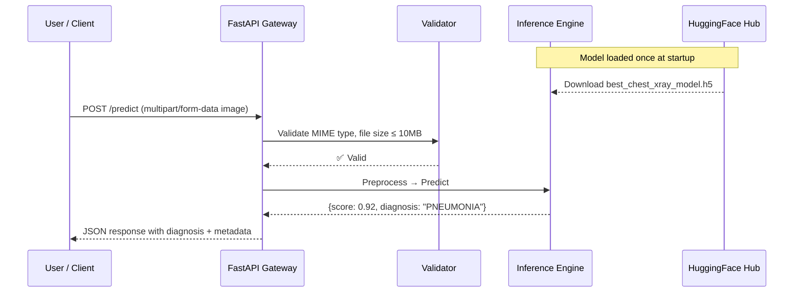
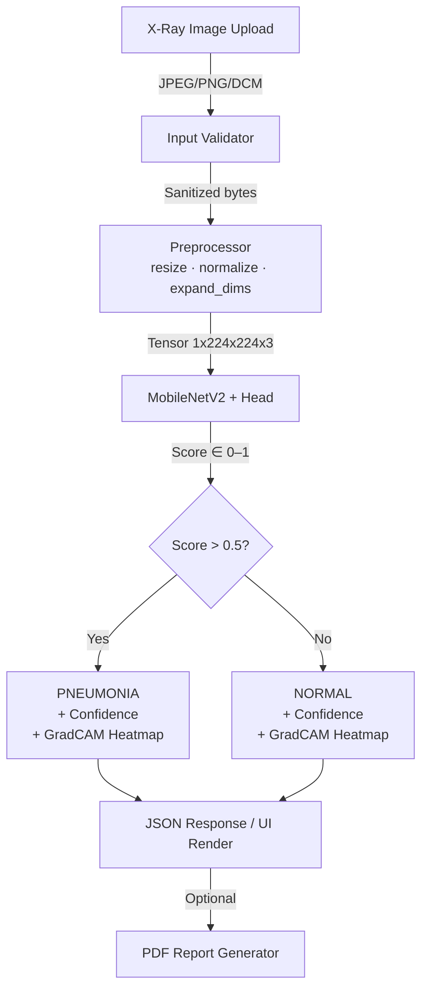

# System Architecture — PneumoDetect AI

> **Document Status:** Production · **Version:** 1.0 · **Owner:** Engineering

---

## 1. Overview

PneumoDetect AI is a **stateless, containerized, single-model inference system** designed around the principle of maximum clinical safety with minimum operational complexity. It consists of three primary user-facing layers — a Streamlit web application, a FastAPI REST backend, and a HuggingFace-hosted model registry — backed by a single domain model (MobileNetV2).

```
                   ┌─────────────────────────────────────────┐
                   │           PneumoDetect AI System         │
                   │                                          │
   User Browser ──►│  Streamlit Web App  (port 8501)         │
   API Consumers ──►│  FastAPI REST API   (port 8000)         │
                   │                                          │
                   │  ┌──────────────────────────────────┐   │
                   │  │  Inference Engine (TF 2.19)       │   │
                   │  │  MobileNetV2 → GAP → Dense → σ    │   │
                   │  └──────────────────────────────────┘   │
                   │                                          │
                   │  Model Source: HuggingFace Hub Registry  │
                   └─────────────────────────────────────────┘
```

---

## 2. Architectural Decisions

### 2.1 Why MobileNetV2?

| Candidate | Accuracy (internal) | Inference Time | Model Size | Decision |
|---|---|---|---|---|
| ResNet50 | ~97.8% | ~120ms | 98MB | ❌ Too heavy for edge |
| VGG16 | ~96.5% | ~200ms | 528MB | ❌ Not deployable |
| **MobileNetV2** | **94.8%** | **~22ms** | **14MB** | ✅ Optimal deployment tradeoff |
| EfficientNetB0 | ~95.2% | ~35ms | 20MB | Runner-up |

MobileNetV2 was selected for its **5× inference speed advantage** and sub-15MB footprint enabling low-resource deployment. The 3% accuracy tradeoff is acceptable for a screening tool.

### 2.2 Why Stateless Design?

Medical imaging data protection (HIPAA intent) demands zero persistence. By processing all images in-memory and never writing to disk, PneumoDetect AI:
- Eliminates PHI data storage risks
- Removes the need for a database
- Enables perfectly horizontal scaling (any pod can serve any request)

### 2.3 Why FastAPI + Streamlit (Not Monolith)?

Separation of concerns:
- **FastAPI**: Pure prediction engine, consumable by any programmatic client (third-party EHRs, research tools, mobile apps)
- **Streamlit**: Rapid UX iteration, clinical staff-facing; state handled client-side in the browser

---

## 3. Request Lifecycle



---

## 4. Component Descriptions

### 4.1 FastAPI Application (`api/main.py`)

- **Framework:** FastAPI 0.111+ with async request handlers
- **Startup:** Loads model from HuggingFace Hub into a module-level singleton
- **CORS:** Configured for Streamlit app origin + wildcard in dev
- **Rate Limiting:** Header-based (pluggable via `slowapi`)
- **Input Validation:** MIME type checking + PIL.Image.verify()

### 4.2 Streamlit Web App (`api/streamlit_api_folder/streamlit_app.py`)

- **Features:** File upload, GradCAM visualization, confidence meter, PDF report generation, DICOM parsing
- **Architecture:** Single-process stateless; model can be loaded locally for offline use
- **Deployment:** Streamlit Cloud with secrets management

### 4.3 Inference Engine

```
Input Image (any format)
    │
    ▼
PIL.Image → RGB → resize(224, 224)
    │
    ▼
numpy.array / 255.0 → shape (1, 224, 224, 3)
    │
    ▼
model.predict()
    │
    ▼
Sigmoid output ∈ [0, 1]
    │
    ├─ > 0.5 → "PNEUMONIA"
    └─ ≤ 0.5 → "NORMAL"
```

### 4.4 Model Architecture

```
Input: (224, 224, 3) normalized CXR image
│
├─ MobileNetV2 Backbone
│   ├─ 154 layers
│   ├─ Weights: ImageNet pre-trained
│   └─ Fine-tuned: Top 20 layers unfrozen
│
├─ GlobalAveragePooling2D
├─ Dropout(0.5)
├─ Dense(128, activation='relu')
└─ Dense(1, activation='sigmoid')    → Pneumonia probability
```

---

## 5. Data Flow Diagram (End-to-End)



---

## 6. Deployment Topology

### 6.1 Local Development

```
localhost:8501  ─── Streamlit App (docker service: streamlit)
localhost:8000  ─── FastAPI   App (docker service: api)
```

### 6.2 Production (Cloud-Native)

```
Internet
  │
  ▼
CDN (Cloudflare / CloudFront)
  │
  ▼
Application Load Balancer
  │
  ├──► Streamlit Service (Container, port 8501)
  │       replica: 1–3 (autoscale on CPU 70%)
  │
  └──► FastAPI Service (Container, port 8000)
          replica: 2–10 (autoscale on request latency > 500ms)
              │
              └──► HuggingFace Hub (model pull on cold start)
```

---

## 7. Cross-Cutting Concerns

### Logging
All log entries follow a structured JSON schema:
```json
{
  "timestamp": "2025-08-18T15:18:33Z",
  "level": "INFO",
  "request_id": "b3c7f1a2",
  "endpoint": "/predict",
  "filename": "xray.jpg",
  "inference_ms": 22,
  "score": 0.9254,
  "diagnosis": "PNEUMONIA"
}
```

### Error Handling
- `400 Bad Request`: Invalid file type or size
- `422 Unprocessable Entity`: Corrupt or incomplete image
- `500 Internal Server Error`: Model inference failure (unlikely post-startup)
- All errors return structured JSON with a `detail` field

---

## 8. Related Documents

| Document | Path |
|---|---|
| AI/ML Pipeline | [`docs/AI_PIPELINE.md`](AI_PIPELINE.md) |
| API Reference | [`docs/API.md`](API.md) |
| Infrastructure | [`docs/INFRASTRUCTURE.md`](INFRASTRUCTURE.md) |
| Security Model | [`docs/SECURITY.md`](SECURITY.md) |
| Scalability | [`docs/SCALABILITY.md`](SCALABILITY.md) |
