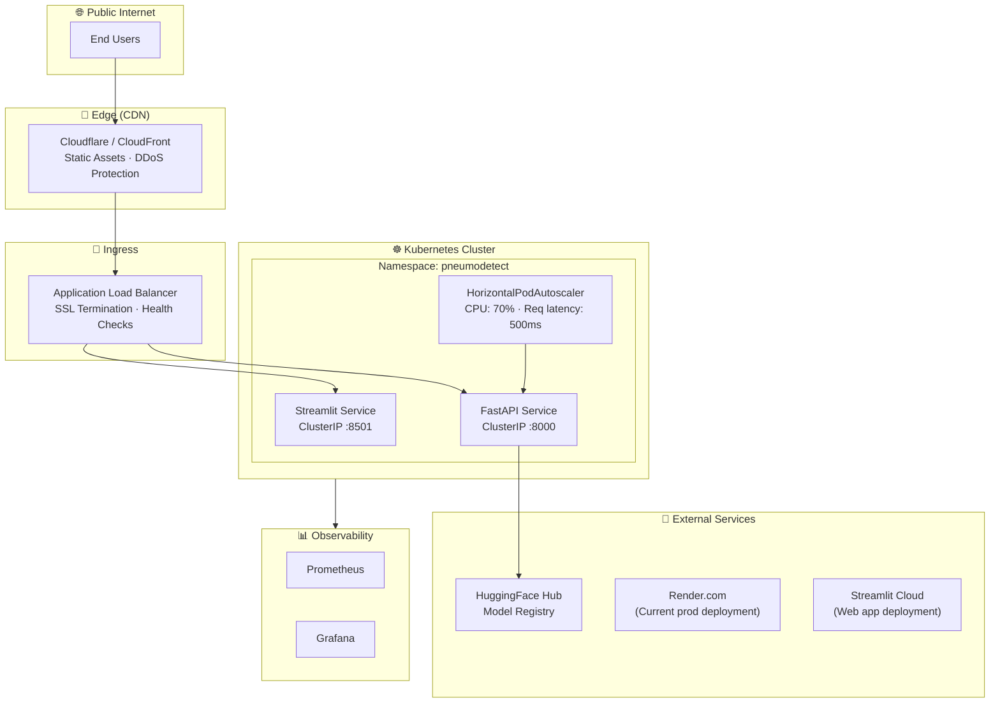
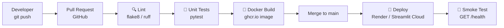

# Infrastructure Design — PneumoDetect AI

> **Document Status:** Production · **Version:** 1.0

---

## 1. Overview

PneumoDetect AI uses a **cloud-native, container-first infrastructure** designed to be platform-agnostic and deployable on AWS, GCP, Azure, or any Kubernetes-compatible environment. The system is architected for horizontal scaling with zero-downtime deployments.

---

## 2. Container Architecture

### 2.1 Docker Image (API)

```dockerfile
# See: infra/docker/Dockerfile
FROM python:3.11-slim
WORKDIR /app
COPY requirements.txt .
RUN pip install --no-cache-dir -r requirements.txt
COPY api/ /app/api/
EXPOSE 8000
CMD ["uvicorn", "api.main:app", "--host", "0.0.0.0", "--port", "8000"]
```

### 2.2 Docker Compose (Local)

```yaml
# See: infra/docker/docker-compose.yml
services:
  api:       # FastAPI on :8000
  streamlit: # Streamlit on :8501
```

---

## 3. Cloud Architecture



---

## 4. Kubernetes Specifications

### 4.1 Deployment

```yaml
# infra/k8s/deployment.yaml
apiVersion: apps/v1
kind: Deployment
metadata:
  name: pneumodetect-api
  namespace: pneumodetect
spec:
  replicas: 2
  selector:
    matchLabels:
      app: pneumodetect-api
  template:
    spec:
      containers:
      - name: api
        image: ghcr.io/thriniiiiiiiiiiii/pneumodetect-api:latest
        ports:
        - containerPort: 8000
        resources:
          requests:
            memory: "512Mi"
            cpu: "500m"
          limits:
            memory: "2Gi"
            cpu: "2000m"
        livenessProbe:
          httpGet:
            path: /health
            port: 8000
          initialDelaySeconds: 30
          periodSeconds: 10
        readinessProbe:
          httpGet:
            path: /health
            port: 8000
          initialDelaySeconds: 15
          periodSeconds: 5
```

### 4.2 Horizontal Pod Autoscaler

```yaml
apiVersion: autoscaling/v2
kind: HorizontalPodAutoscaler
metadata:
  name: pneumodetect-api-hpa
spec:
  scaleTargetRef:
    apiVersion: apps/v1
    kind: Deployment
    name: pneumodetect-api
  minReplicas: 2
  maxReplicas: 10
  metrics:
  - type: Resource
    resource:
      name: cpu
      target:
        type: Utilization
        averageUtilization: 70
```

---

## 5. Current Production Topology

| Service | Platform | URL |
|---|---|---|
| Streamlit Web App | Streamlit Cloud | pneumodetectai.streamlit.app |
| FastAPI Backend | Render.com | pneumodetect-api.onrender.com |
| Model Weights | HuggingFace Hub | ayushirathour/chest-xray-pneumonia-detection |

---

## 6. CI/CD Pipeline



See: `.github/workflows/ci.yml` and `.github/workflows/deploy.yml`

---

## 7. Secrets Management

| Secret | Storage | Access Pattern |
|---|---|---|
| `HF_TOKEN` | GitHub Actions Secrets | Injected as env var at build/runtime |
| `STREAMLIT_SECRETS` | Streamlit Cloud Secrets | Mounted via `secrets.toml` |
| Container registry credentials | GitHub Actions Secrets | Used in `docker/build-push-action` |

**Rule:** No secrets are ever committed to the repository. `.gitignore` excludes `.env`, `secrets.toml`, and `*.key` files.

---

## 8. Environment Separation

| Environment | Purpose | Config |
|---|---|---|
| `dev` | Local development | `docker-compose.yml` + `.env.dev` |
| `staging` | Pre-prod integration test | Render preview deploys |
| `prod` | Live user traffic | Streamlit Cloud + Render prod |

---

## 9. Rollback Strategy

1. **Container rollback:** `docker pull ghcr.io/...:<previous-tag>` → redeploy
2. **Model rollback:** Switch `HF_MODEL_VERSION` env var to a previous tagged version on HuggingFace Hub
3. **K8s rollback:** `kubectl rollout undo deployment/pneumodetect-api`
4. **SLA target:** Rollback completion within 5 minutes of incident detection
