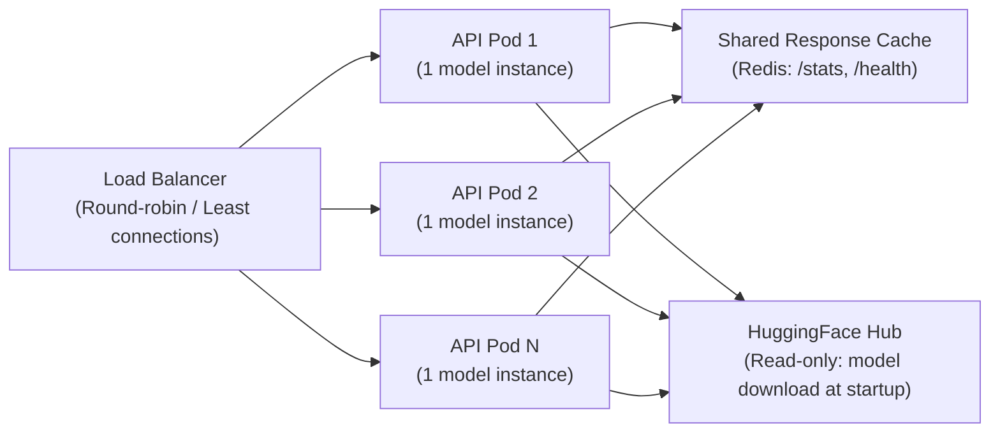

# Scalability Design — PneumoDetect AI

> **Document Status:** Production · **Version:** 1.0

---

## 1. Scalability Architecture

PneumoDetect AI is designed for **horizontal scalability** with a stateless inference model. Every component can be scaled independently with no shared mutable state.

### Design Principles

- **Stateless Services**: No server-side session. Any pod can handle any request.
- **Model as a Singleton**: Model is loaded once at startup and cached in memory — no redundant loading.
- **Zero Database Bottleneck**: No database in the critical path. Pure compute scaling.
- **Async I/O**: FastAPI async endpoints allow high concurrency without thread pool exhaustion.

---

## 2. Scaling Dimensions

| Dimension | Current (MVP) | Production Target | Strategy |
|---|---|---|---|
| **Requests/min** | ~100 | 10,000+ | Horizontal pod autoscaling |
| **Inference Latency (P50)** | ~22ms | < 50ms | Model cache + async |
| **Inference Latency (P99)** | ~200ms | < 500ms | Load balancing + warm pods |
| **Concurrent Users** | ~10 | 1,000+ | Stateless + LB |
| **Geographic Regions** | 1 | 3+ | Multi-region CDN + edge caching |

---

## 3. Horizontal Scaling Strategy



**Scaling triggers (HPA):**
- CPU utilization > 70% → scale out
- Average request latency > 500ms → scale out
- Min replicas: 2 (HA guarantee)
- Max replicas: 10

---

## 4. Performance Optimization Techniques

### 4.1 Model Loading Optimization

```python
# Model loaded ONCE at application startup as a module-level singleton
# This eliminates per-request model load overhead (14MB × N requests)
_model = None

@app.on_event("startup")
async def load_model():
    global _model
    model_path = hf_hub_download(
        repo_id="ayushirathour/chest-xray-pneumonia-detection",
        filename="best_chest_xray_model.h5"
    )
    _model = tf.keras.models.load_model(model_path)
```

### 4.2 Response Caching

Static responses (`/stats`, `/health`) are cached to avoid redundant computation:

```python
from functools import lru_cache

@lru_cache(maxsize=1)
def get_validation_stats() -> dict:
    """Cached — loaded once and served from memory."""
    with open("results/reproducibility/crossop_metrics.json") as f:
        return json.load(f)
```

### 4.3 Async Request Handling

```python
@app.post("/predict")
async def predict(file: UploadFile = File(...)):
    # Non-blocking I/O: file reading + HTTP response
    contents = await file.read()
    # CPU-bound inference runs synchronously in thread pool
    result = await run_in_threadpool(inference_fn, contents)
    return result
```

---

## 5. Bottleneck Analysis

| Component | Bottleneck Type | Mitigation |
|---|---|---|
| **Model Inference** | CPU/memory bound (14ms/req) | Scale pods; GPU upgrade for 10× speedup |
| **Image Decoding** | I/O bound | In-memory PIL; avoid disk I/O |
| **HuggingFace Model Download** | Network (startup only) | Pre-bake model into Docker image for edge |
| **Response Serialization** | Negligible | FastAPI's Pydantic is already optimized |

---

## 6. GPU Scaling Path

When inference volume exceeds CPU capacity (estimated > 500 req/min sustained):

```
Current: CPU inference (14MB MobileNetV2, ~22ms/request)
     ↓
Step 1: TensorFlow GPU (NVIDIA T4) → ~3ms/request
     ↓
Step 2: TensorRT optimization → ~1ms/request
     ↓
Step 3: Batch inference queue (Redis + worker pool) → 10K+ req/min
```

---

## 7. Multi-Region Topology

For global low-latency access:

```
Region: US-East     → FastAPI deployment + CDN PoP
Region: EU-West     → FastAPI deployment + CDN PoP
Region: AP-South    → FastAPI deployment + CDN PoP

Global: HuggingFace Hub (model source, read-only, globally replicated)
Global: CDN (static assets, Streamlit app)
```

---

## 8. SLOs (Service Level Objectives)

| SLO | Target | Measurement |
|---|---|---|
| **Availability** | 99.5% | Monthly uptime (health endpoint monitoring) |
| **P50 Latency** | < 100ms | End-to-end request latency |
| **P99 Latency** | < 500ms | End-to-end request latency |
| **Error Rate** | < 0.1% | 5xx responses / total requests |
| **Model Accuracy** | > 85% | Cross-operator validation AUC (monitored quarterly) |
